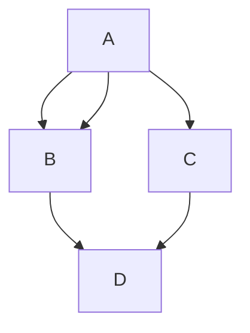

# test

Here is a simple flow chart:


```mermaid
graph TD;
A;
A-->B;

    A-->B;
    A-->C;
    B-->D;
    C-->D;
```


<details><summary>Detail</summary>
<p>

#### We can hide anything, even code!

```ruby
   puts "Hello World"
```

</p>
</details>
