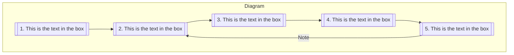

# test
Main Diagram:

Detail

#### Another section

Integer iaculis cursus lacus, commodo cursus lorem imperdiet eu. Quisque a dolor vestibulum, dapibus erat vitae, lacinia elit. Nam aliquam ipsum nec lacus condimentum porta. Maecenas scelerisque suscipit libero, eget sollicitudin dui eleifend sed. Suspendisse sagittis ipsum vel risus ullamcorper, non pharetra nisl fermentum. Pellentesque habitant morbi tristique senectus et netus et malesuada fames ac turpis egestas. Nulla vehicula augue vel eros malesuada, eu accumsan erat imperdiet. 

